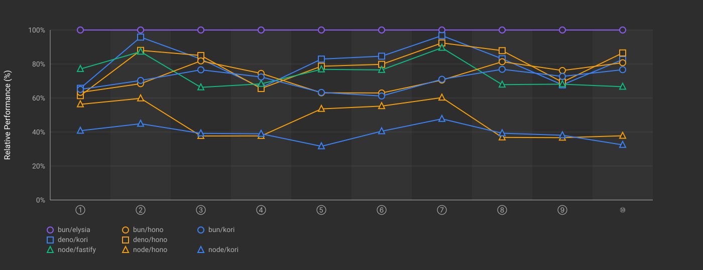
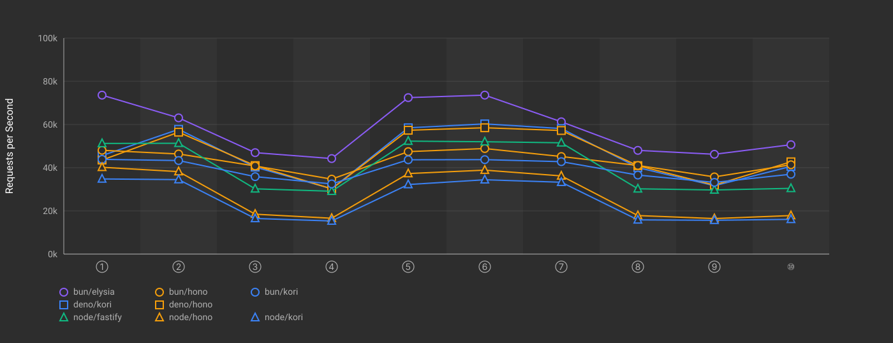

# Kori Framework Benchmarks

> This repository is based on
> [SaltyAom/bun-http-framework-benchmark](https://github.com/SaltyAom/bun-http-framework-benchmark),
> adapted for Kori framework development.

Performance benchmarks for [Kori](https://github.com/bufferings/kori) across
Bun, Node.js, and Deno runtimes.

Kori uses Hono's router internally, aiming to stay within ~10% overhead.

## Prerequisites

- [oha](https://github.com/hatoo/oha) - HTTP benchmarking tool
- Bun, Node.js, and/or Deno runtimes

## Usage

```bash
# Run single-process benchmarks
bun run scripts/bench-single.ts

# Run specific endpoints
bun run scripts/bench-single.ts bun/kori deno/hono

# Custom settings
bun run scripts/bench-single.ts --time=10 --connections=100 --runs=3

# Generate documentation
bun run scripts/report.ts results/single.json docs/bench-single
```

<!-- START BENCHMARK SINGLE RESULTS -->

## Single-Endpoint Benchmark Results

Benchmark results for HTTP frameworks with 1 endpoint per app instance.

### Results (req/s)

| Runtime | Framework      | ping      | query     | body      | zod       | valibot   | arktype   | elysia-t  |
|---------|----------------|-----------:|-----------:|-----------:|-----------:|-----------:|-----------:|-----------:|
| bun     | elysia@1.4.13  |     70,289 |     54,730 |     47,443 |     31,835 |     31,794 |     31,575 |     29,951 |
| deno    | hono@4.10.2    |     65,759 |     44,568 |     32,455 |     25,266 |     27,627 |     28,066 |         - |
| deno    | kori@0.3.4     |     60,905 |     50,725 |     34,590 |     25,011 |     25,574 |     25,759 |         - |
| bun     | hono@4.10.2    |     59,079 |     42,959 |     35,135 |     25,848 |     26,124 |     25,941 |         - |
| bun     | kori@0.3.4     |     57,687 |     50,160 |     41,516 |     22,501 |     22,540 |     22,254 |         - |
| node    | fastify@5.3.2  |     29,299 |     27,454 |     19,738 |         - |         - |         - |         - |
| node    | hono@4.10.2    |     26,625 |     21,614 |      9,017 |      8,280 |      8,302 |      8,041 |         - |
| node    | kori@0.3.4     |     23,881 |     20,945 |      9,407 |      7,875 |      8,125 |      7,685 |         - |
| node    | express@5.1.0  |      6,599 |      6,366 |      4,467 |         - |         - |         - |         - |

### Relative Performance (%)

Overall comparison normalized to percentages. The fastest framework in each test = 100%.


### Absolute Performance (req/s)

Shows the actual requests per second for each framework across all test cases.


### Benchmark Environment

| Item | Value |
|---|---|
| Date | 2025-11-08T09:01:51.466Z |
| Tool | oha |
| Settings | 5s duration, 500 connections, 1 run |
| Runtimes | Bun 1.3.1, Node 22.21.0, Deno 2.5.4 |

Load Machine:

| Item | Value |
|---|---|
| Platform | GCP (2-VM) |
| OS | Debian GNU/Linux 12 (bookworm) |
| CPU | Intel(R) Xeon(R) CPU @ 2.80GHz (2 cores) |
| Memory | 7GB |

Target Machine:

| Item | Value |
|---|---|
| Platform | GCP (2-VM) |
| OS | Debian GNU/Linux 12 (bookworm) |
| CPU | Intel(R) Xeon(R) CPU @ 2.80GHz (2 cores) |
| Memory | 7GB |


<!-- END BENCHMARK SINGLE RESULTS -->


<!-- START BENCHMARK MULTI RESULTS -->

## Multi-Endpoint Benchmark Results

Benchmark results for HTTP frameworks with 10 REST API endpoints per app instance (all validation using Zod).

### Endpoints

| # | Method | Path | Validation |
|---|--------|------|------------|
| ① | GET    | /api/users/:id            | UUID param |
| ② | GET    | /api/users                | Query params (page, limit) |
| ③ | POST   | /api/users                | Body |
| ④ | PUT    | /api/users/:id            | UUID param + body |
| ⑤ | DELETE | /api/users/:id            | UUID param |
| ⑥ | GET    | /api/posts/:id            | Numeric ID param |
| ⑦ | GET    | /api/posts                | Query params (userId, page) |
| ⑧ | POST   | /api/posts                | Body |
| ⑨ | PUT    | /api/posts/:id            | Numeric ID param + body |
| ⑩ | POST   | /api/comments             | Body |


### Results (req/s)

| Runtime | Framework | Avg |
|---------|-----------|-----:|


### Relative Performance (%)

Overall comparison normalized to percentages. The fastest framework for each endpoint = 100%.



### Absolute Performance (req/s)

Shows the actual requests per second for each framework across all endpoints.



### Benchmark Environment

| Item | Value |
|---|---|
| Date | 2025-11-08T11:50:37.350Z |
| Tool | oha |
| Settings | 5s duration, 300 connections, 1 runs |
| Runtimes | Bun 1.3.2, Node 22.21.0, Deno 2.5.6 |

Load Machine:

| Item | Value |
|---|---|
| Platform | linux |
| OS | Debian GNU/Linux 12 (bookworm) |
| CPU | Neoverse-V2 (2 cores) |
| Memory | 7GB |

Target Machine:

| Item | Value |
|---|---|
| Platform | linux |
| OS | Debian GNU/Linux 12 (bookworm) |
| CPU | Neoverse-V2 (2 cores) |
| Memory | 7GB |


<!-- END BENCHMARK MULTI RESULTS -->
