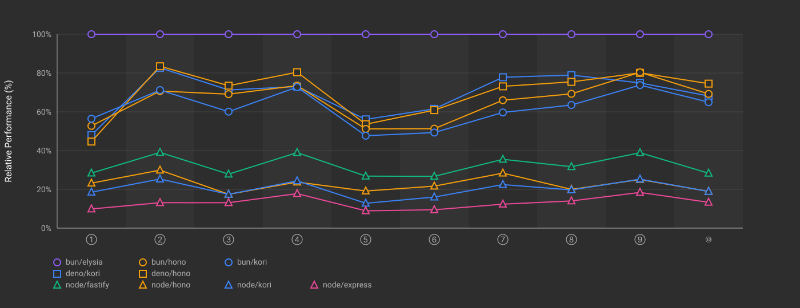
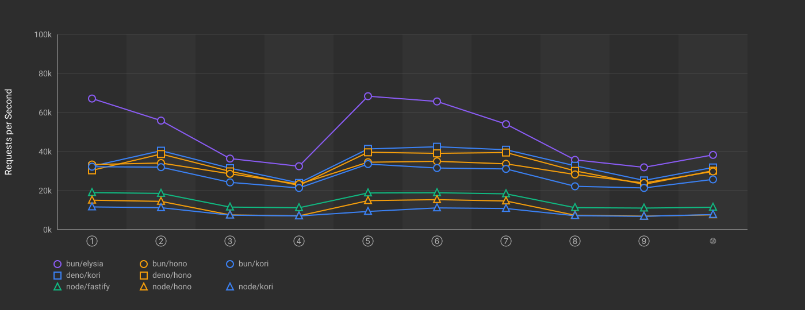

## Multi-Endpoint Benchmark Results

Benchmark results for HTTP frameworks with 10 REST API endpoints per app instance (all validation using Zod).

### Endpoints

| # | Method | Path | Validation |
|---|--------|------|------------|
| ① | GET    | /api/users/:id            | UUID param |
| ② | GET    | /api/users                |  |
| ③ | POST   | /api/users                | Body |
| ④ | PUT    | /api/users/:id            | UUID param + body |
| ⑤ | DELETE | /api/users/:id            | UUID param |
| ⑥ | GET    | /api/posts/:id            | Numeric ID param |
| ⑦ | GET    | /api/posts                |  |
| ⑧ | POST   | /api/posts                | Body |
| ⑨ | PUT    | /api/posts/:id            | Numeric ID param + body |
| ⑩ | POST   | /api/comments             | Body |

### Results (req/s)

| Runtime | Framework | Avg | ①     | ②     | ③     | ④     | ⑤     | ⑥     | ⑦     | ⑧     | ⑨     | ⑩     |
|---------|-----------|-----:|------:|------:|------:|------:|------:|------:|------:|------:|------:|------:|
| bun     | elysia@1.4.13 |     48,593 |       67,164 |       55,862 |       36,401 |       32,478 |       68,359 |       65,671 |       54,058 |       35,737 |       31,920 |       38,282 |
| deno    | kori@0.3.4 |     34,287 |       32,508 |       40,431 |       31,501 |       23,907 |       41,344 |       42,458 |       40,930 |       32,724 |       25,216 |       31,846 |
| deno    | hono@4.10.2 |     32,333 |       30,387 |       38,721 |       29,852 |       22,676 |       39,619 |       39,084 |       39,495 |       30,098 |       23,201 |       30,193 |
| bun     | hono@4.10.2 |     30,461 |       33,365 |       34,127 |       28,599 |       23,311 |       34,536 |       35,003 |       33,709 |       28,253 |       23,895 |       29,808 |
| bun     | kori@0.3.4 |     27,535 |       32,240 |       31,999 |       24,210 |       21,356 |       33,585 |       31,564 |       31,099 |       22,201 |       21,359 |       25,736 |
| node    | fastify@5.3.2 |     15,004 |       18,964 |       18,552 |       11,545 |       11,209 |       18,784 |       18,896 |       18,341 |       11,255 |       11,049 |       11,443 |
| node    | hono@4.10.2 |     11,093 |       15,083 |       14,472 |        7,559 |        7,064 |       14,855 |       15,370 |       14,666 |        7,380 |        6,887 |        7,593 |
| node    | kori@0.3.4 |      9,026 |       11,636 |       11,245 |        7,424 |        6,996 |        9,313 |       11,135 |       10,824 |        7,128 |        6,818 |        7,738 |

### Relative Performance (%)

Overall comparison normalized to percentages. The fastest framework for each endpoint = 100%.

### Absolute Performance (req/s)

Shows the actual requests per second for each framework across all endpoints.

### Benchmark Environment

| Item | Value |
|---|---|
| Date | 2025-11-08T04:23:17.744Z |
| Tool | oha |
| Settings | 30s duration, 200 connections, 3 runs |
| Runtimes | Bun 1.3.1, Node 22.21.1, Deno 2.5.6 |

Machine:

| Item | Value |
|---|---|
| Platform | linux |
| OS | linux 6.11.0-1018-azure |
| CPU | AMD EPYC 7763 64-Core Processor (4 cores) |
| Memory | 15.6GB |
