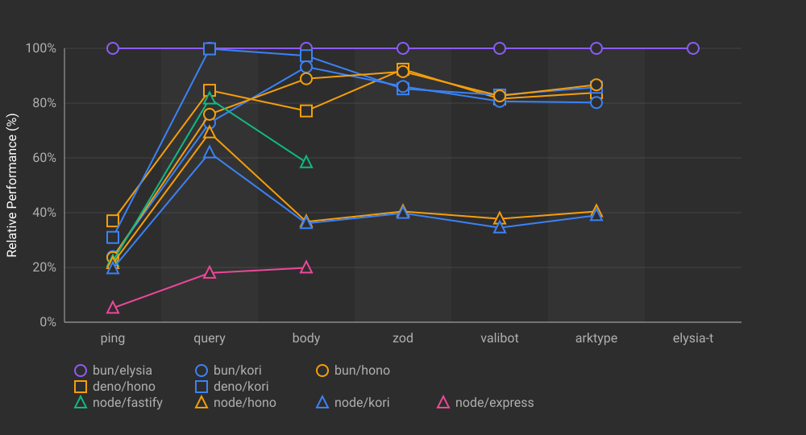
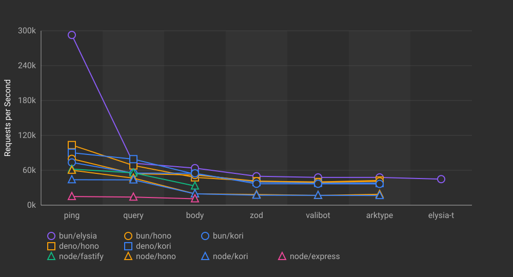

## Single-Endpoint Benchmark Results

Benchmark results for HTTP frameworks with 1 endpoint per app instance.

### Results (req/s)

| Runtime | Framework      | ping      | query     | body      | zod       | valibot   | arktype   | elysia-t  |
|---------|----------------|-----------:|-----------:|-----------:|-----------:|-----------:|-----------:|-----------:|
| bun     | elysia@1.4.13  |     70,289 |     54,730 |     47,443 |     31,835 |     31,794 |     31,575 |     29,951 |
| deno    | hono@4.10.2    |     65,759 |     44,568 |     32,455 |     25,266 |     27,627 |     28,066 |         - |
| deno    | kori@0.3.4     |     60,905 |     50,725 |     34,590 |     25,011 |     25,574 |     25,759 |         - |
| bun     | hono@4.10.2    |     59,079 |     42,959 |     35,135 |     25,848 |     26,124 |     25,941 |         - |
| bun     | kori@0.3.4     |     57,687 |     50,160 |     41,516 |     22,501 |     22,540 |     22,254 |         - |
| node    | fastify@5.3.2  |     29,299 |     27,454 |     19,738 |         - |         - |         - |         - |
| node    | hono@4.10.2    |     26,625 |     21,614 |      9,017 |      8,280 |      8,302 |      8,041 |         - |
| node    | kori@0.3.4     |     23,881 |     20,945 |      9,407 |      7,875 |      8,125 |      7,685 |         - |
| node    | express@5.1.0  |      6,599 |      6,366 |      4,467 |         - |         - |         - |         - |

### Relative Performance (%)

Overall comparison normalized to percentages. The fastest framework in each test = 100%.

### Absolute Performance (req/s)

Shows the actual requests per second for each framework across all test cases.

### Benchmark Environment

| Item | Value |
|---|---|
| Date | 2025-11-08T09:01:51.466Z |
| Tool | oha |
| Settings | 5s duration, 500 connections, 1 run |
| Runtimes | Bun 1.3.1, Node 22.21.0, Deno 2.5.4 |

Load Machine:

| Item | Value |
|---|---|
| Platform | GCP (2-VM) |
| OS | Debian GNU/Linux 12 (bookworm) |
| CPU | Intel(R) Xeon(R) CPU @ 2.80GHz (2 cores) |
| Memory | 7GB |

Target Machine:

| Item | Value |
|---|---|
| Platform | GCP (2-VM) |
| OS | Debian GNU/Linux 12 (bookworm) |
| CPU | Intel(R) Xeon(R) CPU @ 2.80GHz (2 cores) |
| Memory | 7GB |
