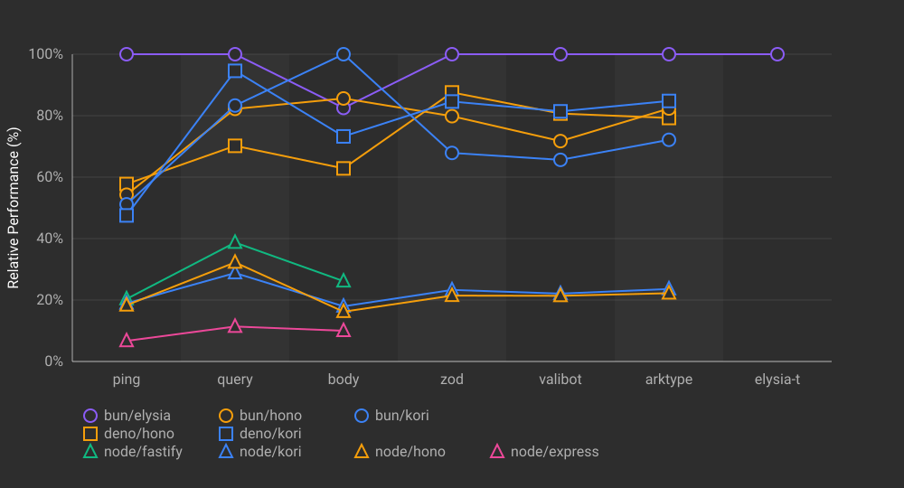
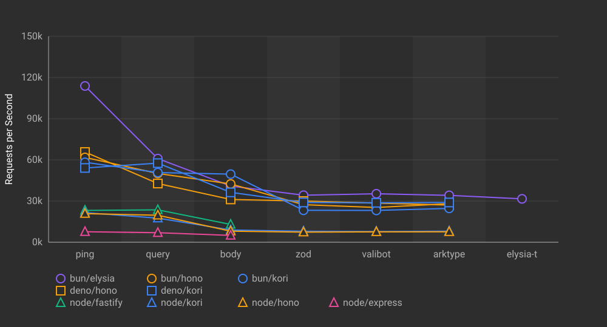

## Single Process Benchmark Results

Benchmark results for HTTP frameworks running in a single process (1 endpoint per app instance).

### Results (req/s)

| Runtime | Framework      | ping      | query     | body      | zod       | valibot   | arktype   | elysia-t  |
|---------|----------------|-----------:|-----------:|-----------:|-----------:|-----------:|-----------:|-----------:|
| bun     | elysia@1.4.13  |    126,560 |     66,185 |     50,883 |     35,552 |     37,271 |     37,496 |     32,183 |
| bun     | hono@4.10.2    |     71,706 |     52,942 |     41,512 |     27,282 |     29,727 |     28,990 |         - |
| deno    | hono@4.10.2    |     65,011 |     43,437 |     33,030 |     30,650 |     28,983 |     29,996 |         - |
| bun     | kori@0.3.4     |     62,603 |     56,514 |     43,918 |     25,399 |     25,738 |     25,759 |         - |
| deno    | kori@0.3.4     |     57,884 |     47,926 |     38,350 |     27,911 |     27,502 |     25,811 |         - |
| node    | fastify@5.3.2  |     27,169 |     25,881 |     13,517 |         - |         - |         - |         - |
| node    | hono@4.10.2    |     22,052 |     18,907 |      8,185 |      7,475 |      7,472 |      7,443 |         - |
| node    | kori@0.3.4     |     20,472 |     18,197 |      9,080 |      7,917 |      7,939 |      7,814 |         - |
| node    | express@5.1.0  |      7,522 |      7,114 |      5,179 |         - |         - |         - |         - |

### Relative Performance (%)

Overall comparison normalized to percentages. The fastest framework in each test = 100%.

### Absolute Performance (req/s)

Shows the actual requests per second for each framework across all test cases.

### Benchmark Environment

| Item | Value |
|---|---|
| Date | 2025-11-08T03:40:28.919Z |
| Tool | oha |
| Settings | 30s duration, 200 connections, 3 runs |
| Runtimes | Bun 1.3.1, Node 22.21.1, Deno 2.5.6 |

Machine:

| Item | Value |
|---|---|
| Platform | linux |
| OS | linux 6.11.0-1018-azure |
| CPU | AMD EPYC 7763 64-Core Processor (4 cores) |
| Memory | 15.6GB |
